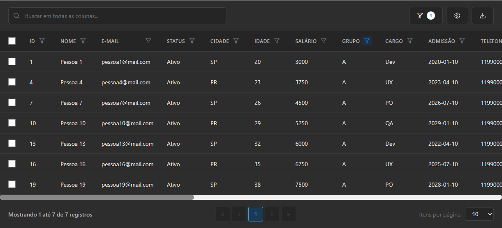
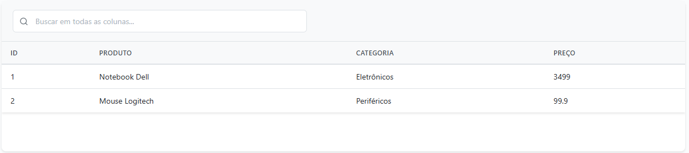
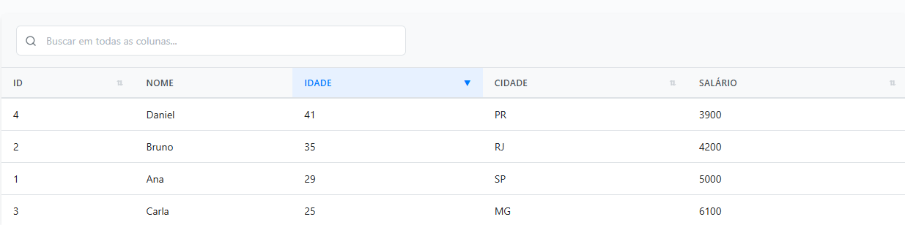
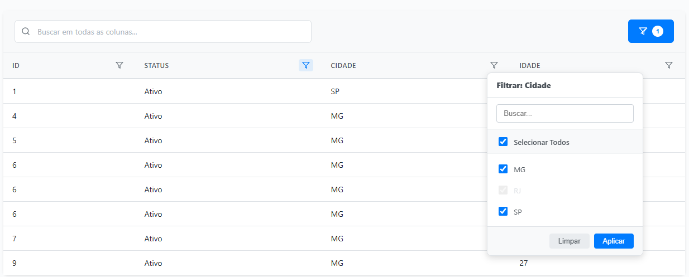
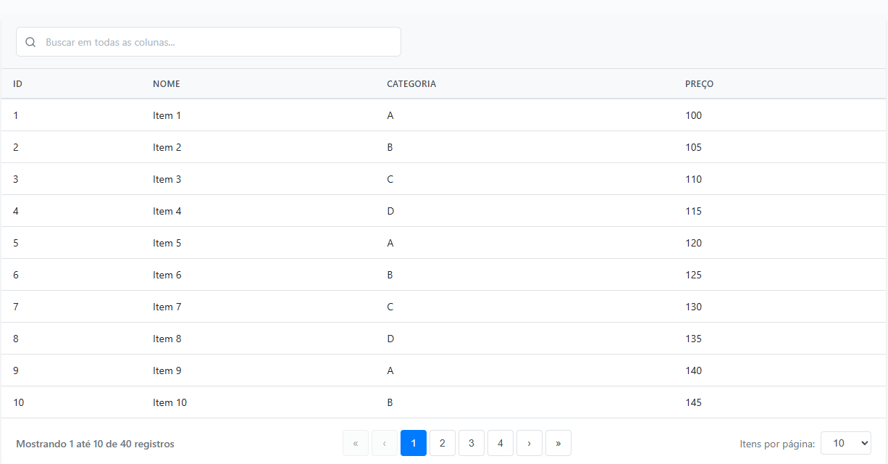
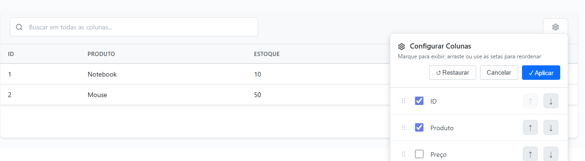
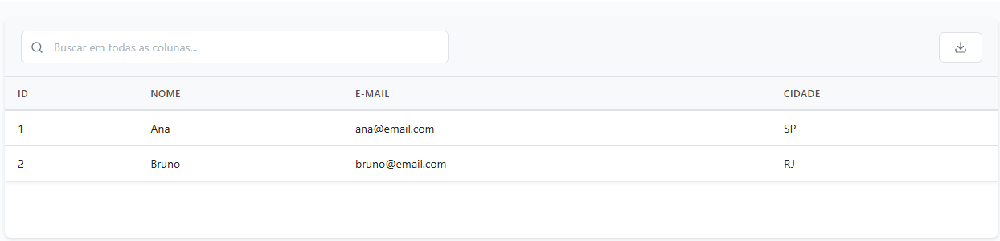
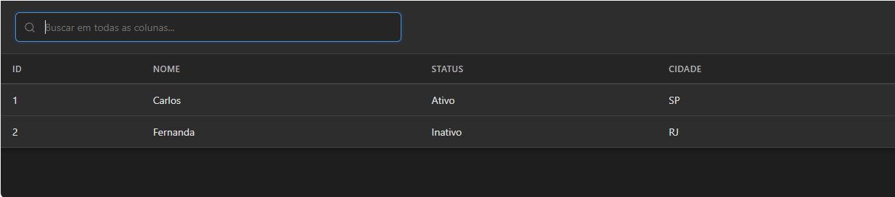

# 

> Modern JavaScript library for interactive tables with cascading filters, accent-insensitive search, and advanced features

[](https://www.npmjs.com/package/skargrid)
[](https://www.npmjs.com/package/skargrid)
[](LICENSE)

Website: [https://skargrid.com](https://skargrid.com)

🇧🇷 [Leia em Português](README.pt-br.md)

---

## 📸 Skargrid in Action

### 🏆 Complete Example (All Features)

<div align="center"><sub>All features enabled: sorting, filters, selection, export, dark theme, column config, large dataset</sub></div>

---

# 📚 Visual Examples

Below are visual examples of Skargrid features, in recommended order:

#### Minimal Example

<div align="center"><sub>Minimal setup: 4 columns, no extra features</sub></div>

#### Complete Example

<div align="center"><sub>All features enabled: sorting, filters, selection, export, dark theme, column config, large dataset</sub></div>

#### Sorting

<div align="center"><sub>Sortable columns</sub></div>

#### Filters

<div align="center"><sub>Column filters (Excel-style)</sub></div>

#### Pagination

<div align="center"><sub>Pagination enabled</sub></div>

#### Selection

<div align="center"><sub>Row selection</sub></div>

#### Column Config

<div align="center"><sub>Column configuration (show/hide, reorder, persist)</sub></div>

#### Export

<div align="center"><sub>Export to CSV</sub></div>

#### Dark Theme

<div align="center"><sub>Dark mode enabled</sub></div>

#### Large Dataset

<div align="center"><sub>20+ columns, 50+ rows, horizontal scroll</sub></div>

---


## ✨ Highlights

- 🎨 **Column Configuration** - Drag & drop to reorder, show/hide columns
- 🗄️ **Persistence** - Saves user preferences in localStorage
- 🌓 **Theme Support** - Light/Dark theme with smooth transitions
- 🔄 **Cascading Filters** - Excel-style with unavailable values disabled
- 🌍 **Accent-Insensitive Search** - Automatically removes accents (José = jose)
- ↔️ **Horizontal Scroll** - Custom scrollbar for wide tables
- 📦 **Single Bundle** - Only 2 files (JS + CSS) - ~83KB
- 🎯 **Zero Dependencies** - Pure Vanilla JavaScript
- ⚡ **Performance** - Optimized for large datasets

---

## Release v1.0.1 — Summary of fixes

This release prepares a small, focused set of bugfixes and behavioral improvements completed locally and ready to be published.

Key fixes
- Renderer and export
  - Columns now accept both `render` and legacy `formatter` properties for cell formatting.
  - CSV export uses the column renderer when present and strips HTML to export textual values.

- Filters
  - `select` filters now flatten array-valued cells (e.g. multi-group columns) into individual options.
  - Introduced a special empty-value token `(Em branco)` to let users filter null/empty cells.
  - "Select All" in the filter dropdown now acts only on the currently visible (searched) options and respects disabled (unavailable) options.
  - Fixed available-values calculation so cascading filters reflect select-type filters and array cells correctly.

---

## �🚀 Quick Start

### Installation

**Option 1: CDN (jsDelivr or unpkg)**
Use directly from npm via CDN (always check the latest version):

**jsDelivr**
```html
<link rel="stylesheet" href="https://cdn.jsdelivr.net/npm/skargrid@1.0.1/dist/skargrid.css">
<script src="https://cdn.jsdelivr.net/npm/skargrid@1.0.1/dist/skargrid.min.js"></script>
```

**unpkg**
```html
<link rel="stylesheet" href="https://unpkg.com/skargrid@1.0.1/dist/skargrid.css">
<script src="https://unpkg.com/skargrid@1.0.1/dist/skargrid.min.js"></script>
```

**Option 2: Download**
```bash
# Clone the repository
git clone https://github.com/ScarpelliniGilmar/skargrid.git

# Copy the dist/ files to your project
cp skargrid/dist/skargrid.min.js your-project/
cp skargrid/dist/skargrid.css your-project/
```

**Option 3: NPM**
Install directly from npm:
```bash
npm i skargrid
```
[https://www.npmjs.com/package/skargrid](https://www.npmjs.com/package/skargrid)

---

## 💖 Support the Project

If this project helped you or you want to support new features, consider donating:

- **Liberapay:** [liberapay.com/skargrid](https://liberapay.com/skargrid)

Your contribution helps keep the project active and evolving!

---


# 📚 Complete Documentation

### Configuration

```javascript
new Skargrid(containerId, options)
```

#### Available Options

| Option | Type | Default | Description |
|--------|------|---------|-------------|
| `data` | Array | `[]` | Array of data objects |
| `columns` | Array | `[]` | Column configuration |
| `pagination` | Boolean | `false` | Enable pagination |
| `pageSize` | Number | `10` | Items per page |
| `pageSizeOptions` | Array | `[10,25,50,100]` | Page size options |
| `sortable` | Boolean | `false` | Enable global sorting |
| `selectable` | Boolean | `false` | Enable multi-row selection |
| `searchable` | Boolean | `false` | Enable global search |
| `columnFilters` | Boolean | `false` | Enable column filters |
| `columnConfig` | Boolean | `false` | Enable column config button |
| `persistColumnConfig` | Boolean | `false` | Save column config in localStorage |
| `storageKey` | String | `'skargrid-config-{id}'` | localStorage key (if persistColumnConfig=true) |
| `theme` | String | `'light'` | Visual theme: 'light' or 'dark' |
| `className` | String | `'skargrid'` | Table CSS class |

#### Column Configuration

```javascript
{
  field: 'name',           // Data object field (required)
  title: 'Full Name',      // Header title
  width: '200px',          // Column width (optional)
  visible: true,           // Initial visibility (default: true)
  sortable: true,          // Allow sorting (default: false)
  filterable: true,        // Show filter icon (default: false)
  filterType: 'text',      // Type: 'text', 'number', 'date', 'select'
  // Custom formatting
  render: (value, row) => {
    return `<span style="color: blue;">${value}</span>`;
  }
}
```

### Filter Types

#### 1. Text Filter (`filterType: 'text'`)
```javascript
{ field: 'name', title: 'Name', filterType: 'text' }
```
- Partial, case-insensitive search
- **Automatically removes accents** (José = jose)
- Simple input

#### 2. Number Filter (`filterType: 'number'`)
```javascript
{ field: 'age', title: 'Age', filterType: 'number' }
```
- Exact number comparison
- Numeric input

#### 3. Date Filter (`filterType: 'date'`)
```javascript
{ field: 'birthDate', title: 'Birth Date', filterType: 'date' }
```
- Search by date (ISO format: YYYY-MM-DD)
- HTML5 date input

#### 4. Select Filter (`filterType: 'select'`)
```javascript
{ field: 'city', title: 'City', filterType: 'select' }
```
- **Excel-style cascading filter**
- Checkboxes with unique values
- Unavailable values are disabled
- Internal search in dropdown
- "Select All" / "Deselect All"

---

## 🎨 Public API

### Methods

```javascript
// Update data
table.updateData(newData);

// Get current data
const data = table.getData();

// Selection
const selected = table.getSelectedRows();      // Returns objects
const indices = table.getSelectedIndices();     // Returns indices
table.selectRows([0, 1, 2]);                   // Select by index
table.clearSelection();                         // Clear selection

// Filters
table.clearAllFilters();                        // Clear search + column filters
table.clearSearch();                            // Clear only global search

// Navigation
table.goToPage(3);                             // Go to specific page
table.changePageSize(25);                       // Change items per page

// Themes
table.setTheme('dark');                         // Switch between 'light' and 'dark'

// Column Config (if columnConfig=true)
table.saveColumnConfig();                       // Save manually to localStorage
table.loadColumnConfig();                       // Load saved config
table.clearSavedColumnConfig();                 // Remove saved config

// Destroy instance
table.destroy();
```

### Advanced Features

#### 🎨 Theme Support

```javascript
// Dark theme
const table = new Skargrid('myTable', {
  data: data,
  columns: columns,
  theme: 'dark'
});

// Switch theme dynamically
table.setTheme('dark');  // or 'light'
```

#### 🎯 Column Configuration

```javascript
const table = new Skargrid('myTable', {
  data: data,
  columns: columns,
  columnConfig: true,              // Enable config button
  persistColumnConfig: true,       // Save user preferences
  storageKey: 'my-table-key'       // Custom key (optional)
});

// User can:
// - Reorder columns (drag & drop)
// - Show/hide columns (checkboxes)
// - Use arrows to move columns
// - Restore default config
// - Config is saved automatically in localStorage
```

#### 👁️ Hidden Columns by Default

```javascript
const columns = [
  { field: 'id', title: 'ID' },
  { field: 'name', title: 'Name' },
  { 
    field: 'phone', 
    title: 'Phone',
    visible: false  // Hidden by default
  },
  { 
    field: 'email', 
    title: 'E-mail',
    visible: false  // Hidden by default
  }
];

// User can show via config button
```

### Events and Callbacks

```javascript
const table = new Skargrid('myTable', {
  data: data,
  columns: columns,
  // Callback after render (future)
  onRender: (grid) => {
    console.log('Table rendered!', grid);
  }
});
```

---

## 🔧 Build & Development

### Project Structure

```
skargrid/
├── build.ps1
├── dist/
│   ├── skargrid-features.js
│   ├── skargrid.css
│   ├── skargrid.min.js
│   └── themes/
│       ├── dark.css
│       └── light.css
├── docs/
│   ├── img/
│   │   ├── columns.png
│   │   ├── complete.png
│   │   ├── export.png
│   │   ├── filters.png
│   │   ├── minimal.png
│   │   ├── pagination.png
│   │   ├── selection.png
│   │   ├── sort.png
│   │   └── theme-dark.png
│   └── skargrid-examples.html
├── lang/
├── LICENSE
├── package.json
├── README.md
├── README.pt-br.md
├── src/
│   ├── core/
│   │   └── skargrid.js
│   ├── css/
│   │   ├── skargrid.css
│   │   └── themes/
│   │       ├── dark.css
│   │       └── light.css
│   └── features/
│       ├── columnConfig.js
│       ├── export.js
│       ├── filter.js
│       ├── pagination.js
│       ├── selection.js
│       └── sort.js
└── .gitignore
```

### Manual Build

```powershell
# PowerShell (Windows)
.\build.ps1

# Or with PowerShell Core (cross-platform)
pwsh -File build.ps1
```

**Output:**
- `dist/skargrid.min.js` - Full bundle (~56KB)
- `dist/skargrid.css` - Styles
- `dist/themes/` - Optional themes

---

## 🎯 Examples

### Example 1: Simple Table with Search
```javascript
const table = new Skargrid('container', {
  data: myData,
  columns: [
    { field: 'id', title: 'ID' },
    { field: 'name', title: 'Name' }
  ],
  searchable: true
});
```

### Example 2: Complete Table
```javascript
const table = new Skargrid('container', {
  data: myData,
  columns: [
    { 
      field: 'id', 
      title: 'ID', 
      width: '60px',
      sortable: true 
    },
    { 
      field: 'name', 
      title: 'Name',
      sortable: true,
      filterable: true,
      filterType: 'text'
    },
    { 
      field: 'status', 
      title: 'Status',
      filterType: 'select',
      render: (value) => {
        const color = value === 'Active' ? 'green' : 'red';
        return `<span style="color: ${color}">● ${value}</span>`;
      }
    }
  ],
  pagination: true,
  pageSize: 10,
  sortable: true,
  selectable: true,
  searchable: true,
  columnFilters: true
});
```

### Example 3: Large Dataset (25 columns)
See `examples/large-dataset.html` for a full example with:
- 25 varied columns
- 100 records
- All filter types
- Custom formatting
- Horizontal scroll

---

## 🎨 Themes

### Default Theme (Light)
```html
<link rel="stylesheet" href="dist/skargrid.css">
```

### Dark Theme
```html
<link rel="stylesheet" href="dist/skargrid.css">
<link rel="stylesheet" href="dist/themes/dark.css">
```

### Customization
```css
/* Override CSS variables */
.skargrid {
  --sg-primary-color: #007bff;
  --sg-hover-bg: #f8f9fa;
  --sg-border-color: #dee2e6;
}
```

---

## 🤝 Contributing

Contributions are welcome! Please:

1. Fork the project
2. Create a branch (`git checkout -b feature/NewFeature`)
3. Commit your changes (`git commit -m 'Add new feature'`)
4. Push to the branch (`git push origin feature/NewFeature`)
5. Open a Pull Request

---

## 📜 License

MIT License - see [LICENSE](LICENSE) for details.

Copyright (c) 2024-2025 GILMAR A S TRINDADE

---

## 👨‍💻 Author

**GILMAR A S TRINDADE**

- GitHub: [@ScarpelliniGilmar](https://github.com/ScarpelliniGilmar)
- Email: gilmar.trindade@hotmail.com

---

## 🌟 Roadmap

- [x] Public CDN
- [x] NPM package
- [x] Export to CSV
- [ ] Advanced filters (range, multi-value)
- [ ] Inline editing
- [ ] Frozen columns
- [ ] Row grouping
- [ ] Additional themes
- [ ] TypeScript definitions
- [ ] React/Vue/Angular wrappers

---

**⭐ If this project was useful, consider starring it on GitHub!**