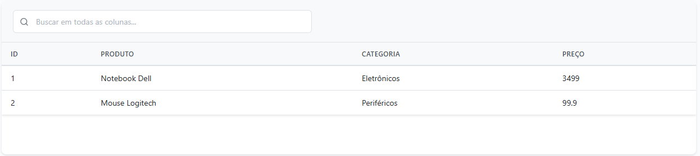
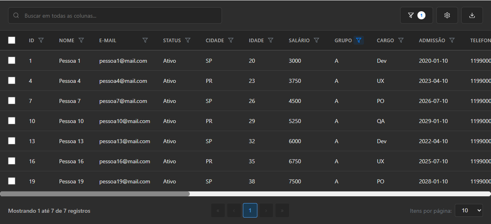
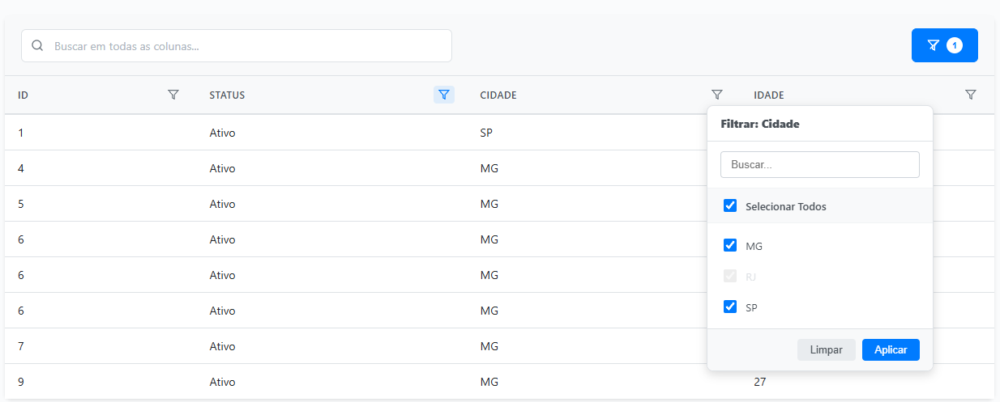
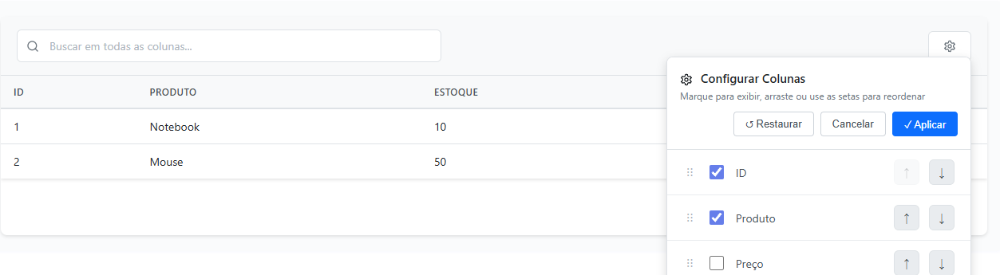
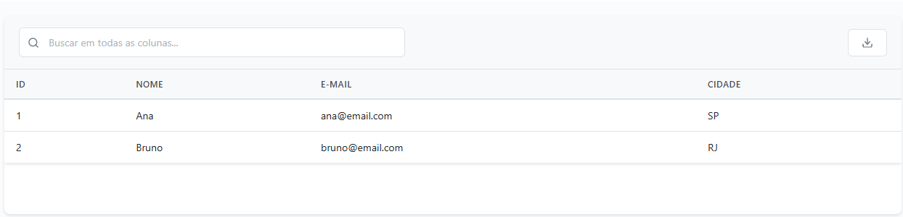
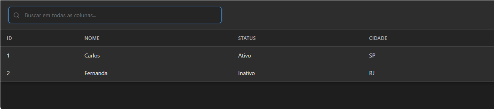

# 

> Biblioteca JavaScript moderna para criação de tabelas interativas com filtros cascata, busca normalizada e recursos avançados

[](https://www.npmjs.com/package/skargrid)
[](https://www.npmjs.com/package/skargrid)
[](LICENSE)
[](https://bundlephobia.com/package/skargrid)

**Site:** [https://skargrid.com](https://skargrid.com) •
**[Read in English](README.md)**

---

## Sumário

- [Principais Recursos](#principais-recursos)
- [Exemplos Visuais](#exemplos-visuais)
- [Diretrizes de Performance e Limitações](#diretrizes-de-performance-e-limitações)
- [Início Rápido](#início-rápido)
- [Exemplos Completos](#exemplos-completos)
- [Benchmarks de Performance](#benchmarks-de-performance)
- [Internacionalização (i18n)](#internacionalização-i18n)
- [Referência da API](#referência-da-api)
- [Temas e Estilização](#temas-e-estilização)
- [Build e Desenvolvimento](#build-e-desenvolvimento)
- [Changelog](#changelog)
- [Contribuição](#contribuição)
- [Licença](#licença)
- [Apoie o Projeto](#apoie-o-projeto)

---

## Principais Recursos

- **Internacionalização (i18n)** - Sistema profissional de labels, totalmente personalizável para qualquer idioma (português, espanhol, francês, etc.)
- **Rolagem Virtual** - Renderização de alta performance para datasets grandes, validada com 50k linhas em Chromium, Firefox e WebKit
- **Configuração de Colunas** - Arrastar e soltar para reordenar, mostrar/ocultar colunas com persistência
- **Persistência Inteligente** - Salva preferências do usuário no localStorage automaticamente
- **Suporte a Temas** - Tema claro/escuro com transições suaves e variáveis customizáveis
- **Filtros Select Inteligentes** - Filtros select aprimorados para mostrar apenas opções disponíveis quando outras colunas estão filtradas, com comportamento de busca inteligente que isola seleções durante a pesquisa
- **Busca Sem Acentos** - Trata acentos automaticamente (José = jose)
- **Rolagem Horizontal** - Barra de rolagem customizada para tabelas largas
- **Processamento Server-Side** *Novo na 2.0* - Delegue paginação, ordenação, filtro e busca ao seu backend via eventos (veja [Processamento Server-Side](#processamento-server-side))
- **Persistência de Estado** *Novo na 2.0* - `getState()`/`setState()` serializáveis, com persistência automática opcional no `localStorage` via `persistState`
- **Colunas Congeladas** *Novo na 2.0* - Fixe colunas à esquerda durante a rolagem horizontal com `column.frozen`
- **Agregações no Rodapé** *Novo na 2.0* - `sum`/`avg`/`count`/`min`/`max` ou funções customizadas, calculadas sobre os dados filtrados
- **Event Bus** *Novo na 2.0* - `on()`/`off()`/`emit()` para `sortChange`, `pageChange`, `selectionChange`, `filterChange`, `rowClick`
- **Renderização Segura por Padrão** *Novo na 2.0* - `render()`/`formatter()` retornam texto puro a menos que você habilite HTML explicitamente (proteção XSS, veja [Segurança](#segurança))
- **Bundle Único** - Apenas 2 arquivos (JS + CSS) - **~15.5KB gzip** (65.6KB minificado)
- **Zero Dependências** - JavaScript puro Vanilla, agnóstico a frameworks
- **Testes Automatizados** - 70 testes Jest + 42 testes Playwright em 3 navegadores (Chromium, Firefox, WebKit)
- **Suporte a Exportação** - Exportação CSV e XLSX nativa sem dependências externas

---

## Exemplos Visuais

Abaixo exemplos visuais dos recursos do SkarGrid, em ordem de aprendizado recomendada:

#### Configuração Básica

<div align="center"><sub>Tabela básica: 4 colunas, ordenação, paginação</sub></div>

#### Recursos Completos

<div align="center"><sub>Todos os recursos: ordenação, filtros, seleção, exportação, tema escuro, config. de colunas</sub></div>

#### Filtragem Avançada

<div align="center"><sub>Filtros cascata estilo Excel com busca</sub></div>

#### Gerenciamento de Colunas

<div align="center"><sub>Reordenamento arrastar/soltar e alternância de visibilidade</sub></div>

#### Exportação de Dados

<div align="center"><sub>Exportação para formatos CSV e XLSX</sub></div>

#### Tema Escuro

<div align="center"><sub>Tema escuro integrado com transições suaves</sub></div>

---

## Diretrizes de Performance e Limitações

### Uso Recomendado
- **Client-side (todos os recursos)**: até ~25.000 registros — busca, ordenação, filtros e exportação continuam responsivos
- **Rolagem virtual**: recomendada acima de ~10.000 registros com `virtualization: true`; validada com 50.000 linhas em navegadores reais (Chromium, Firefox e WebKit) pela suíte Playwright do projeto
- **Acima disso**: use [processamento server-side](#processamento-server-side) — o grid recebe uma página por vez e delega paginação, ordenação, filtro e busca ao seu backend; o tamanho do dataset vira limite do servidor, não do navegador

### Melhores Práticas

**Para datasets grandes:**
```javascript
// Recomendado: abordagem server-side
const grid = new Skargrid('grid', {
  data: pageData, // Apenas página atual
  pagination: true,
  serverSide: true,
  // Servidor cuida: filtragem, ordenação, paginação
});
```

**Para datasets pequenos:**
```javascript
// Tudo client-side
const grid = new Skargrid('grid', {
  data: fullDataset, // Até ~25K registros
  searchable: true,
  sortable: true,
  columnFilters: true,
});
```

**Veja Exemplos Reais:**
- [Guia de server-side processing](https://skargrid.com/api/state#server-side-processing) — padrão completo de busca por eventos
- `docs/playground.html` (rode localmente com `npm run dev`) — inclui uma seção de virtualização com 50K linhas e uma de server-side com servidor fake

---

## Início Rápido

### Instalação

**Opção 1: CDN (Recomendado)**
```html
<link rel="stylesheet" href="https://cdn.jsdelivr.net/npm/skargrid@latest/dist/skargrid.min.css">
<script src="https://cdn.jsdelivr.net/npm/skargrid@latest/dist/skargrid.min.js"></script>
```

**Opção 2: NPM**
```bash
npm install skargrid
```

**Opção 3: Download**
```bash
git clone https://github.com/ScarpelliniGilmar/skargrid.git
cp skargrid/dist/* seu-projeto/
```

### Uso Básico

```html
<!DOCTYPE html>
<html>
<head>
    <link rel="stylesheet" href="https://cdn.jsdelivr.net/npm/skargrid@latest/dist/skargrid.min.css">
</head>
<body>
    <div id="minhaTabela"></div>

    <script src="https://cdn.jsdelivr.net/npm/skargrid@latest/dist/skargrid.min.js"></script>
    <script>
        const dados = [
            { id: 1, nome: 'João Silva', idade: 28, cidade: 'São Paulo' },
            { id: 2, nome: 'Maria Santos', idade: 32, cidade: 'Rio de Janeiro' }
        ];

        const colunas = [
            { field: 'id', title: 'ID', width: '60px' },
            { field: 'nome', title: 'Nome', sortable: true },
            { field: 'idade', title: 'Idade', sortable: true },
            { field: 'cidade', title: 'Cidade' }
        ];

        const tabela = new Skargrid('minhaTabela', {
            data: dados,
            columns: colunas,
            pagination: true,
            sortable: true,
            searchable: true
        });
    </script>
</body>
</html>
```

---

## Exemplos Completos

### Tabela Completa com Todos os Recursos

```html
<!DOCTYPE html>
<html lang="pt-BR">
<head>
    <meta charset="UTF-8">
    <meta name="viewport" content="width=device-width, initial-scale=1.0">
    <title>Demonstração SkarGrid</title>
    <link rel="stylesheet" href="https://cdn.jsdelivr.net/npm/skargrid@latest/dist/skargrid.min.css">
</head>
<body>
    <div id="myTable"></div>

    <script src="https://cdn.jsdelivr.net/npm/skargrid@latest/dist/skargrid.min.js"></script>
    <script>
        // Dados de exemplo
        const funcionarios = [
            { id: 1, name: 'João Silva', age: 28, city: 'São Paulo', salary: 3500, department: 'TI', active: true },
            { id: 2, name: 'Maria Santos', age: 32, city: 'Rio de Janeiro', salary: 4200, department: 'RH', active: true },
            { id: 3, name: 'Pedro Costa', age: 25, city: 'Belo Horizonte', salary: 2800, department: 'Vendas', active: false },
            { id: 4, name: 'Ana Oliveira', age: 29, city: 'Porto Alegre', salary: 3800, department: 'Marketing', active: true },
            { id: 5, name: 'Carlos Mendes', age: 35, city: 'Curitiba', salary: 5500, department: 'TI', active: true }
        ];

        // Configuração das colunas
        const columns = [
            { field: 'id', title: 'ID', width: '60px', sortable: true, filterType: 'number' },
            { field: 'name', title: 'Nome', sortable: true, filterType: 'text' },
            { field: 'age', title: 'Idade', width: '80px', sortable: true, filterType: 'number' },
            { field: 'city', title: 'Cidade', sortable: true, filterType: 'select' },
            {
                field: 'salary',
                title: 'Salário',
                sortable: true,
                filterType: 'number',
                render: (value) => `R$ ${value.toLocaleString('pt-BR')}`
            },
            { field: 'department', title: 'Departamento', filterType: 'select' },
            {
                field: 'active',
                title: 'Status',
                render: (value) => value ? ' Ativo' : ' Inativo'
            }
        ];

        // Inicializar SkarGrid com todas as features
        const table = new Skargrid('myTable', {
            data: funcionarios,
            columns: columns,
            pagination: true,
            pageSize: 10,
            sortable: true,
            searchable: true,
            columnFilters: true,
            selectable: true,
            columnConfig: true,
            persistColumnConfig: true,
            exportCSV: true,
            exportXLSX: true,
            exportFilename: 'funcionarios',
            theme: 'light'
        });
    </script>
</body>
</html>
```

### Exemplo de Gerenciamento de Dados

```javascript
// Inicializar tabela
const table = new Skargrid('myTable', {
    data: dadosIniciais,
    columns: columns,
    pagination: true,
    searchable: true
});

// Atualizar dados dinamicamente
function atualizarTabela(novosDados) {
    table.updateData(novosDados);
}

// Manipular mudanças de seleção
function aoMudarSelecao() {
    const linhasSelecionadas = table.getSelectedRows();
    console.log('Itens selecionados:', linhasSelecionadas);

    // Exportar apenas linhas selecionadas
    if (linhasSelecionadas.length > 0) {
        table.exportSelectedToCSV('itens-selecionados.csv');
    }
}

// Limpar todos os filtros
function resetarFiltros() {
    table.clearAllFilters();
}

// Alterar tema
function alternarTema() {
    const temaAtual = table.options.theme;
    table.setTheme(temaAtual === 'light' ? 'dark' : 'light');
}
```

### Estilização Avançada

```css
/* Variáveis de tema customizado */
:root {
    --sg-primary: #2563eb;
    --sg-accent: #1d4ed8;
    --sg-gray: #6b7280;
    --sg-white: #ffffff;
}

/* Estilização customizada da tabela */
.skargrid {
    border-radius: 8px;
    box-shadow: 0 4px 6px -1px rgba(0, 0, 0, 0.1);
}

.skargrid thead th {
    background: linear-gradient(135deg, var(--sg-primary), var(--sg-accent));
    color: white;
    font-weight: 600;
}

/* Design responsivo */
@media (max-width: 768px) {
    .skargrid {
        font-size: 14px;
    }

    .skargrid-search-container {
        flex-direction: column;
    }
}
```

### Exemplo de Rolagem Virtual

```html
<!DOCTYPE html>
<html lang="pt-BR">
<head>
    <meta charset="UTF-8">
    <meta name="viewport" content="width=device-width, initial-scale=1.0">
    <title>Exemplo de Rolagem Virtual</title>
    <link rel="stylesheet" href="dist/skargrid.min.css">
</head>
<body>
    <div id="virtualTable"></div>

    <script src="dist/skargrid.min.js"></script>
    <script>
        // Gerar dataset grande para teste
        function generateLargeDataset() {
            const data = [];
            const cities = ['São Paulo', 'Rio de Janeiro', 'Belo Horizonte', 'Salvador', 'Brasília'];
            const departments = ['TI', 'RH', 'Vendas', 'Marketing', 'Financeiro'];

            for (let i = 1; i <= 25000; i++) {
                data.push({
                    id: i,
                    nome: `Pessoa ${i}`,
                    idade: Math.floor(Math.random() * 50) + 18,
                    cidade: cities[Math.floor(Math.random() * cities.length)],
                    salario: Math.floor(Math.random() * 10000) + 2000,
                    departamento: departments[Math.floor(Math.random() * departments.length)]
                });
            }
            return data;
        }

        const columns = [
            { field: 'id', title: 'ID', width: '60px', sortable: true },
            { field: 'nome', title: 'Nome', sortable: true },
            { field: 'idade', title: 'Idade', width: '70px', sortable: true },
            { field: 'cidade', title: 'Cidade', sortable: true, filterType: 'select' },
            { field: 'salario', title: 'Salário', sortable: true, render: v => `R$ ${v.toLocaleString('pt-BR')}` },
            { field: 'departamento', title: 'Departamento', filterType: 'select' }
        ];

        // Inicializar com rolagem virtual
        const table = new Skargrid('virtualTable', {
            data: generateLargeDataset(),
            columns: columns,
            virtualization: true,  // Habilitar rolagem virtual
            searchable: true,
            sortable: true,
            columnFilters: true,
            height: '500px'        // Altura fixa para rolagem virtual
        });
    </script>
</body>
</html>
```

### Exemplo de Internacionalização

```html
<!DOCTYPE html>
<html lang="pt-BR">
<head>
    <meta charset="UTF-8">
    <meta name="viewport" content="width=device-width, initial-scale=1.0">
    <title>Exemplo de i18n</title>
    <link rel="stylesheet" href="dist/skargrid.min.css">
</head>
<body>
    <div id="i18nTable"></div>

    <script src="dist/skargrid.min.js"></script>
    <script>
        const data = [
            { id: 1, nome: 'João Silva', idade: 28, cidade: 'São Paulo', salario: 3500 },
            { id: 2, nome: 'Maria Santos', idade: 32, cidade: 'Rio de Janeiro', salario: 4200 },
            { id: 3, nome: 'Pedro Costa', idade: 25, cidade: 'Belo Horizonte', salario: 2800 }
        ];

        const columns = [
            { field: 'id', title: 'ID', width: '60px', sortable: true },
            { field: 'nome', title: 'Nome', sortable: true },
            { field: 'idade', title: 'Idade', width: '80px', sortable: true },
            { field: 'cidade', title: 'Cidade', sortable: true },
            { field: 'salario', title: 'Salário', sortable: true, render: v => `R$ ${v.toLocaleString('pt-BR')}` }
        ];

        // Inicializar com rótulos em português
        const table = new Skargrid('i18nTable', {
            data: data,
            columns: columns,
            pagination: true,
            searchable: true,
            columnFilters: true,
            exportCSV: true,
            labels: {
                searchPlaceholder: 'Buscar em todas as colunas...',
                clearFilters: 'Limpar Filtros',
                exportCSV: 'Exportar CSV',
                exportXLSX: 'Exportar XLSX',
                filterTitle: 'Filtrar: {title}',
                selectAll: 'Selecionar Todos',
                filterSearchPlaceholder: 'Buscar...',
                filterInputPlaceholder: 'Digite para filtrar...',
                clear: 'Limpar',
                apply: 'Aplicar',
                showing: 'Mostrando {start} até {end} de {total} registros',
                filteredOfTotal: 'filtrados de {total} total',
                itemsPerPage: 'Itens por página:',
                noRowsSelected: 'Nenhuma linha selecionada para exportar.',
                columnConfigTitle: 'Configurar Colunas',
                columnConfigDescription: 'Marque para exibir, arraste ou use setas para reordenar',
                restore: 'Restaurar',
                cancel: 'Cancelar',
                noData: 'Nenhum dado disponível',
                loading: 'Carregando...'
            }
        });
    </script>
</body>
</html>
```

### Exemplo de Dataset Grande (50K Registros, Virtualizado)

Esta é a mesma escala exercitada pela suíte Playwright do projeto em Chromium, Firefox e WebKit:

```html
<!DOCTYPE html>
<html lang="pt-BR">
<head>
    <meta charset="UTF-8">
    <meta name="viewport" content="width=device-width, initial-scale=1.0">
    <title>Exemplo de Dataset Grande</title>
    <link rel="stylesheet" href="dist/skargrid.min.css">
</head>
<body>
    <div id="largeTable"></div>

    <script src="dist/skargrid.min.js"></script>
    <script>
        // Gerar 50.000 registros
        function generateLargeDataset() {
            const data = [];
            const cities = ['São Paulo', 'Rio de Janeiro', 'Belo Horizonte', 'Porto Alegre', 'Curitiba'];
            const companies = ['TechCorp', 'DataSys', 'InfoTech', 'WebSolutions', 'CloudNet'];

            for (let i = 1; i <= 50000; i++) {
                data.push({
                    id: i,
                    name: `Pessoa ${i}`,
                    age: Math.floor(Math.random() * 50) + 18,
                    city: cities[Math.floor(Math.random() * cities.length)],
                    company: companies[Math.floor(Math.random() * companies.length)],
                    salary: Math.floor(Math.random() * 100000) + 30000
                });
            }
            return data;
        }

        const columns = [
            { field: 'id', title: 'ID', width: '80px', sortable: true },
            { field: 'name', title: 'Nome', sortable: true },
            { field: 'age', title: 'Idade', width: '70px', sortable: true },
            { field: 'city', title: 'Cidade', filterType: 'select' },
            { field: 'company', title: 'Empresa', filterType: 'select' },
            { field: 'salary', title: 'Salário', sortable: true, render: v => `R$ ${v.toLocaleString('pt-BR')}` }
        ];

        // virtualização exige altura fixa e substitui a paginação
        const table = new Skargrid('largeTable', {
            data: generateLargeDataset(),
            columns: columns,
            virtualization: true,
            searchable: true,
            sortable: true,
            columnFilters: true,
            height: '600px'
        });
    </script>
</body>
</html>
```

### Exemplo de Paginação Server-Side

```html
<!DOCTYPE html>
<html lang="pt-BR">
<head>
    <meta charset="UTF-8">
    <meta name="viewport" content="width=device-width, initial-scale=1.0">
    <title>Exemplo de Paginação Server-Side</title>
    <link rel="stylesheet" href="dist/skargrid.min.css">
</head>
<body>
    <div id="serverTable"></div>

    <script src="dist/skargrid.min.js"></script>
    <script>
        // Simular dados do servidor (50.000 registros total)
        let currentPage = 1;
        const pageSize = 100;
        const totalRecords = 50000;

        // API mock do servidor
        function fetchPageData(page, filters = {}, sort = {}) {
            return new Promise((resolve) => {
                setTimeout(() => {
                    const startIndex = (page - 1) * pageSize;
                    const data = [];

                    for (let i = 0; i < pageSize; i++) {
                        const id = startIndex + i + 1;
                        if (id > totalRecords) break;

                        data.push({
                            id: id,
                            name: `Usuário ${id}`,
                            email: `usuario${id}@exemplo.com`,
                            role: ['Admin', 'Usuário', 'Gerente'][Math.floor(Math.random() * 3)],
                            status: Math.random() > 0.5 ? 'Ativo' : 'Inativo',
                            lastLogin: new Date(Date.now() - Math.random() * 365 * 24 * 60 * 60 * 1000).toLocaleDateString('pt-BR')
                        });
                    }

                    resolve({
                        data: data,
                        total: totalRecords,
                        page: page,
                        pageSize: pageSize
                    });
                }, 200); // Simular delay de rede
            });
        }

        const columns = [
            { field: 'id', title: 'ID', width: '80px', sortable: true },
            { field: 'name', title: 'Nome', sortable: true },
            { field: 'email', title: 'Email', sortable: true },
            { field: 'role', title: 'Função', filterType: 'select' },
            { field: 'status', title: 'Status', filterType: 'select' },
            { field: 'lastLogin', title: 'Último Login', sortable: true }
        ];

        // Inicializar tabela
        const table = new Skargrid('serverTable', {
            data: [],
            columns: columns,
            pagination: true,
            pageSize: pageSize,
            searchable: true,
            columnFilters: true,
            serverSide: true,
            totalRecords: totalRecords
        });

        // Carregar dados iniciais
        fetchPageData(1).then(result => {
            table.updateData(result.data);
        });

        // Manipular mudanças de página
        table.on('pageChange', (page) => {
            fetchPageData(page).then(result => {
                table.updateData(result.data);
            });
        });

        // Manipular mudanças de filtro
        table.on('filterChange', (filters) => {
            fetchPageData(1, filters).then(result => {
                table.updateData(result.data);
                table.setTotalRecords(result.total);
            });
        });
    </script>
</body>
</html>
```

---

## Performance

### O que está de fato verificado

- A suíte de testes de navegador (Playwright) exercita um **grid virtualizado de 50.000 linhas** em Chromium, Firefox e WebKit a cada execução do CI — incluindo rolagem, filtragem e ciclos de destroy/recriação.
- Versões antigas publicavam tabelas de benchmark sintéticas medidas em jsdom; esses números não eram reproduzíveis em navegadores reais e não são mais divulgados. Benchmarks reproduzíveis em navegador real estão no roadmap.

### Recursos de Performance

- **Rolagem Virtual**: Apenas as linhas visíveis (mais um buffer) são renderizadas
- **Busca com Debounce**: Evita filtragem excessiva enquanto o usuário digita
- **Processamento Server-Side**: Para datasets que nem deveriam viver no navegador — veja [Processamento Server-Side](#processamento-server-side)

### Escolhendo a abordagem

| Tamanho do dataset | Abordagem |
| --- | --- |
| Até ~25 mil registros | Client-side, todos os recursos habilitados |
| ~10–50 mil registros | Adicione `virtualization: true` (exige `height` fixo, substitui a paginação) |
| Acima disso | `serverSide: true` — o grid segura uma página por vez |

---

## Internacionalização (i18n)

O SkarGrid vem com labels padrão em inglês, mas suporta personalização completa para qualquer idioma. Sobrescreva os labels passando um objeto `labels` nas opções:

```javascript
const grid = new Skargrid('myGrid', {
  // ... outras opções
  labels: {
    searchPlaceholder: 'Buscar em todas as colunas...',
    clearFilters: 'Limpar Filtros',
    exportCSV: 'Exportar CSV',
    filterTitle: 'Filtrar: {title}',
    selectAll: 'Selecionar Todos',
    clear: 'Limpar',
    apply: 'Aplicar',
    showing: 'Mostrando {start} até {end} de {total} registros',
    itemsPerPage: 'Itens por página:'
  }
});
```

Chaves de labels disponíveis:
- `searchPlaceholder` - Placeholder do campo de busca
- `clearFilters` - Botão limpar filtros
- `exportCSV` / `exportXLSX` - Botões de exportação
- `filterTitle` - Título do dropdown de filtro (suporta placeholder `{title}`)
- `selectAll` - Checkbox "selecionar todos" nos filtros
- `filterSearchPlaceholder` - Busca dentro do dropdown de filtro
- `filterInputPlaceholder` - Placeholder do filtro de input
- `clear` / `apply` - Botões do filtro
- `showing` - Info de paginação (suporta `{start}`, `{end}`, `{total}`)
- `filteredOfTotal` - Sufixo da contagem filtrada
- `itemsPerPage` - Label do seletor de tamanho da página
- `columnConfigTitle` - Título do modal de configuração de colunas
- `columnConfigDescription` - Descrição da configuração de colunas
- `restore` / `cancel` - Botões da configuração de colunas
- `noRowsSelected` - Mensagem de erro de exportação
- `noData` - Mensagem de estado vazio
- `loading` - Mensagem de carregamento

---

## Referência da API

### Construtor

```javascript
new Skargrid(containerId, options)
```

### Opções

| Opção | Tipo | Padrão | Descrição |
|-------|------|--------|-----------|
| `data` | Array | `[]` | Array de objetos de dados |
| `columns` | Array | `[]` | Configuração das colunas |
| `pagination` | Boolean | `false` | Habilita paginação |
| `pageSize` | Number | `10` | Itens por página |
| `pageSizeOptions` | Array | `[10,25,50,100]` | Opções de tamanho de página |
| `sortable` | Boolean | `false` | Habilita ordenação global |
| `selectable` | Boolean | `false` | Habilita seleção múltipla de linhas |
| `searchable` | Boolean | `false` | Habilita busca global |
| `columnFilters` | Boolean | `false` | Habilita filtros por coluna |
| `columnConfig` | Boolean | `false` | Habilita botão de configuração de colunas |
| `persistColumnConfig` | Boolean | `false` | Salva configuração de colunas no localStorage |
| `storageKey` | String | `'skargrid-config-{id}'` | Chave do localStorage |
| `theme` | String | `'light'` | Tema visual: 'light' ou 'dark' |
| `className` | String | `'skargrid'` | Classe CSS da tabela |
| `exportCSV` | Boolean | `false` | Habilita botão de exportação CSV |
| `exportXLSX` | Boolean | `false` | Habilita botão de exportação XLSX |
| `exportFilename` | String | `'skargrid-export'` | Nome base para arquivos exportados |
| `allowUnsafeHtml` | Boolean | `false` | Trata o retorno em string de `render()`/`formatter()` como HTML em vez de texto puro (ver [Segurança](#segurança)) |
| `persistState` | Boolean | `false` | Persiste/restaura `getState()`/`setState()` via localStorage |
| `stateStorageKey` | String | `'skargrid-state-{id}'` | Chave do localStorage para `persistState` |
| `stateVersion` | Number | `1` | Estado salvo com versão diferente é descartado |
| `footerAggregates` | Boolean | `false` | Exibe um rodapé (`<tfoot>`) com o valor de `aggregate` de cada coluna |
| `serverSide` | Boolean | `false` | Delega paginação/ordenação/filtro/busca ao servidor (ver [Server-Side Processing](#server-side-processing)) |
| `totalRecords` | Number | `0` | Total de registros no servidor; atualize com `setTotalRecords()` |

### Configuração de Colunas

```javascript
{
    field: 'nome',           // Campo do objeto de dados (obrigatório)
    title: 'Nome Completo',  // Título do cabeçalho
    width: '200px',          // Largura da coluna (opcional)
    visible: true,           // Visibilidade inicial (padrão: true)
    sortable: true,          // Permitir ordenação (padrão: false)
    sortType: 'string',      // Tipo de ordenação: 'string', 'number', 'date'
    filterable: true,        // Mostrar ícone de filtro (padrão: false)
    filterType: 'text',      // Tipo: 'text', 'number', 'date', 'select'
    frozen: true,            // Fixa a coluna à esquerda durante o scroll horizontal (padrão: false).
                              // Precisa formar um prefixo contíguo (a partir da primeira coluna de
                              // dados, após a coluna de seleção, se houver) — uma coluna frozen depois
                              // de uma não-frozen é ignorada com um console.warn, não aplicada errado.
    render: (value, row) => { // Formatação customizada — texto retornado é seguro por padrão (textContent)
        return value.toUpperCase();
    }
    // Precisa de HTML/DOM de verdade (badges, ícones)? Prefira retornar um Node — sempre tratado como seguro:
    // render: (value) => {
    //     const span = document.createElement('span');
    //     span.style.color = 'blue';
    //     span.textContent = value;
    //     return span;
    // }
    // Retornar uma string HTML em vez de um Node exige opt-in explícito,
    // já que a responsabilidade de mantê-la livre de dados não confiáveis é sua:
    // allowUnsafeHtml: true
    aggregate: 'sum',         // Valor no rodapé (exige options.footerAggregates: true).
                              // Embutidos: 'sum' | 'avg' | 'count' | 'min' | 'max', ou uma
                              // função customizada (rows, field) => valor. Calculado sobre
                              // filteredData (respeita busca/filtros, não só a página atual).
    aggregateFormatter: (value, rows) => `R$ ${value.toFixed(2)}`, // opcional, formata a célula do rodapé
}
```

### Segurança

O retorno de `column.render()`/`column.formatter()` é tratado como **texto puro por padrão** (`textContent`) — tags HTML na string não são interpretadas, então dado não confiável (entrada do usuário, resposta de API) não consegue injetar marcação ou script. Há duas formas seguras de renderizar HTML/DOM de verdade:

1. **Preferível:** retornar um `Node` (ex.: `document.createElement(...)`) — sempre anexado com segurança, independente de qualquer flag.
2. Retornar uma string HTML e habilitar `allowUnsafeHtml: true`, globalmente (todas as colunas) ou só na coluna que precisa. Faça isso apenas para conteúdo que você controla — nunca para entrada de usuário sem escapar.

```javascript
columns: [
  // Seguro: Node, sem precisar de flag
  { field: 'status', render: v => { const s = document.createElement('span'); s.textContent = v; return s; } },
  // Opt-in: string HTML, só nesta coluna
  { field: 'nota', render: v => `<b>${v}</b>`, allowUnsafeHtml: true },
]
```

### Métodos

```javascript
// Gerenciamento de dados
table.updateData(novosDados);
const dados = table.getData();

// Seleção
const selecionados = table.getSelectedRows();
const indices = table.getSelectedIndices();
table.selectRows([0, 1, 2]);
table.clearSelection();

// Filtros
table.clearAllFilters();
table.clearSearch();

// Navegação
table.goToPage(3);
table.changePageSize(25);

// Tema
table.setTheme('dark');

// Configuração de colunas
table.saveColumnConfig();
table.loadColumnConfig();
table.clearSavedColumnConfig();

// Exportação
table.exportToCSV('dados.csv');
table.exportSelectedToCSV('selecionados.csv');
table.exportToXLSX('dados.xlsx');
table.exportSelectedToXLSX('selecionados.xlsx');

// Estado (ver options.persistState para persistência automática via localStorage)
const estado = table.getState();
table.setState(estado);
table.clearPersistedState(); // relevante só quando persistState: true

// Limpeza
table.destroy();
```

### Eventos

```javascript
// Escutar eventos
table.on('sortChange', (coluna, direcao) => {
    console.log('Ordenado por', coluna, direcao); // direcao: 'asc' | 'desc' | null
});

table.on('pageChange', (pagina) => {
    console.log('Página atual:', pagina);
});

table.on('selectionChange', (linhasSelecionadas) => {
    console.log('Seleção alterada:', linhasSelecionadas);
});

table.on('filterChange', () => {
    console.log('Filtros alterados. Linhas atuais:', table.getData().length);
});

table.on('rowClick', (linha, indice) => {
    console.log('Linha clicada:', linha, indice);
});

// Mesmos eventos que options.onSortChange / onPageChange / onSelectionChange /
// onFilterChange / onRowClick (atalho no construtor para on()).

// off(evento, handler?) remove um listener específico, ou todos os listeners do evento
table.off('sortChange', meuHandler);
```

### Server-Side Processing

Com `serverSide: true`, o grid para de paginar/ordenar/filtrar/buscar localmente: `data` é sempre entendido como exatamente a página atual, já ordenada e filtrada pelo seu servidor. O grid não é dono da requisição — você escuta os mesmos eventos `pageChange`/`sortChange`/`filterChange`, faz a requisição do seu jeito (qualquer cliente HTTP, qualquer biblioteca) e devolve o resultado com `updateData()` + `setTotalRecords()`:

```javascript
const table = new Skargrid('minhaTabela', {
    data: [],
    columns: [
        { field: 'id', title: 'ID' },
        { field: 'nome', title: 'Nome', sortable: true },
        { field: 'cidade', title: 'Cidade', filterable: true },
    ],
    pagination: true,
    pageSize: 20,
    sortable: true,
    searchable: true,
    columnFilters: true,
    serverSide: true,
});

async function buscarPagina() {
    table.showLoading();
    table.render(false);

    const resposta = await fetch(`/api/usuarios?page=${table.currentPage}&pageSize=${table.options.pageSize}` +
        `&sort=${table.sortColumn ?? ''}&dir=${table.sortDirection ?? ''}&q=${table.searchText}`);
    const { data, total } = await resposta.json();

    table.hideLoading();
    table.updateData(data);       // as linhas da página atual — não reseta página/ordenação/busca em modo server
    table.setTotalRecords(total); // recalcula o total de páginas
}

table.on('pageChange', buscarPagina);
table.on('sortChange', buscarPagina);
table.on('filterChange', buscarPagina); // cobre busca e filtros de coluna
buscarPagina(); // carga inicial
```

**Limitações conhecidas:**
- Filtros de coluna do tipo select (`filterType: 'select'`) calculam a lista de checkboxes a partir de `data` — em modo server-side isso é só a página atual, não o conjunto completo de valores distintos. Busque os valores distintos no seu próprio endpoint se precisar da lista completa.
- Seleção de linhas usa índices relativos à página; selecionar através de várias páginas do servidor não é rastreado automaticamente.

---

## Temas e Estilização

### Temas Integrados

```javascript
// Tema claro (padrão)
const table = new Skargrid('myTable', {
    data, columns,
    theme: 'light'
});

// Tema escuro
const table = new Skargrid('myTable', {
    data, columns,
    theme: 'dark'
});

// Alternar tema dinamicamente
table.setTheme('dark');
```

### Variáveis CSS Customizáveis

```css
:root {
    /* Cores primárias */
    --sg-primary: #2563eb;
    --sg-primary-hover: #1d4ed8;

    /* Cores de fundo */
    --sg-bg: #ffffff;
    --sg-bg-secondary: #f8fafc;
    --sg-bg-hover: #f1f5f9;

    /* Cores de texto */
    --sg-text: #1e293b;
    --sg-text-secondary: #64748b;

    /* Cores de borda */
    --sg-border: #e2e8f0;
    --sg-border-hover: #cbd5e1;

    /* Cores de destaque */
    --sg-accent: #06b6d4;
    --sg-success: #10b981;
    --sg-warning: #f59e0b;
    --sg-error: #ef4444;
}
```

### Exemplos de Estilização Customizada

```css
/* Aparência customizada da tabela */
.skargrid {
    border-radius: 12px;
    box-shadow: 0 10px 25px -5px rgba(0, 0, 0, 0.1);
    font-family: 'Inter', system-ui, sans-serif;
}

/* Estilização customizada do cabeçalho */
.skargrid thead th {
    background: linear-gradient(135deg, #667eea 0%, #764ba2 100%);
    color: white;
    font-weight: 600;
    text-transform: uppercase;
    letter-spacing: 0.5px;
}

/* Efeitos de hover customizados nas linhas */
.skargrid tbody tr:hover {
    background: linear-gradient(90deg, #f8fafc 0%, #e2e8f0 100%);
    transform: translateY(-1px);
    box-shadow: 0 4px 12px rgba(0, 0, 0, 0.05);
}
```

---

### Pré-requisitos
- Node.js 16+
- PowerShell (Windows) ou Bash (Linux/Mac)

### Configuração de Desenvolvimento
```bash
# Clonar repositório
git clone https://github.com/ScarpelliniGilmar/skargrid.git
cd skargrid

# Instalar dependências
npm install

# Iniciar servidor de desenvolvimento
npm run dev

# Executar testes
npm test

# Build para produção
npm run build
```

### Estrutura do Projeto
```
skargrid/
├── dist/                 # Arquivos compilados (ESM, CJS, IIFE/CDN, CSS, source maps)
├── src/
│   ├── index.js         # Ponto de entrada público (importa core + CSS)
│   ├── core/
│   │   └── skargrid.js  # Ciclo de vida, estado central, event bus e coordenação
│   ├── features/        # Um módulo ES por feature (busca, filtros, paginação,
│   │                    #   ordenação, seleção, exportação, virtualização,
│   │                    #   colunas congeladas, agregações, persistência, ...)
│   └── css/             # Folhas de estilo e temas
├── types/               # Declarações TypeScript (publicadas)
├── tests/               # Jest (unitário/integração) + Playwright (navegador)
├── docs/                # Site de documentação VitePress + playground local
└── package.json
```

### Arquitetura

- **Core** (`src/core/skargrid.js`) é dono do ciclo de vida, do objeto de `state` central, do event bus tipado (`on`/`off`/`emit`) e da coordenação entre features.
- **Features** (`src/features/`) são módulos ES reais importados diretamente pelo core — um módulo por capacidade, comunicando-se pela instância do grid em vez de acessar internals umas das outras.
- **Renderização segura por padrão**: o conteúdo das células passa por `textContent`, a menos que um renderer retorne um `Node` ou `allowUnsafeHtml` seja habilitado explicitamente.
- Cada feature tem testes dedicados; o comportamento no navegador é verificado com Playwright em Chromium, Firefox e WebKit.

### Comandos de Build
```bash
# Build completo (lint + testes + typecheck + bundle)
npm run build

# Apenas o bundle
npm run build:bundle

# Modo watch (rebuild a cada alteração) + servidor local do playground
npm run dev

# Apenas modo watch
npm run watch

# Lint do código
npm run lint

# Executar testes
npm run test

# Testes de navegador (Playwright, 3 engines)
npm run test:browser

# Site de documentação (VitePress)
npm run docs:dev      # servidor de dev com live-reload
npm run docs:build    # build estático (falha se houver link morto)
```

---

## Changelog

### [v2.0.0] - 2026-07-07
- **Refatoração do Core**: estado central, event bus tipado e renderer seguro por padrão
- **Incompatível**: strings retornadas por `render()`/`formatter()` agora são texto puro por padrão (proteção XSS). Retorne um `Node` ou habilite `allowUnsafeHtml: true` — veja o [guia de migração](https://skargrid.com/migration/1x-to-community)
- **Novas funcionalidades**: server-side processing, persistência de estado, colunas congeladas, agregações no rodapé
- **API**: `getState()`/`setState()`, event bus (`on`/`off`/`emit`), `destroy()` confiável
- **Documentação nova**: https://skargrid.com — com `llms.txt` e JSON Schemas para agentes de IA
- Detalhes completos no [CHANGELOG.md](CHANGELOG.md)

### [v1.4.0] - 2025-11-16
- **Refatoração Completa da Arquitetura Modular**: Reestruturação arquitetural majoritária com 13 módulos especializados de features
- **Redução do Core**: Módulo core reduzido em 25% (~450 linhas) através de extração sistemática de features
- **Módulos de Features**: Separação completa de responsabilidades com módulos dedicados para:
  - Busca e Filtragem: `search.js`, `input-filter.js`, `select-filter.js`, `filter.js`
  - Apresentação de Dados: `table-header.js`, `table-body.js`, `top-bar.js`, `virtualization.js`
  - Funcionalidades: `pagination.js`, `sort.js`, `selection.js`, `export.js`, `columnConfig.js`
- **Performance Mantida**: Todos os 21 testes passando, sem degradação de performance
- **Compatibilidade Backward**: Degradação graciosa com verificações de disponibilidade de features
- **Tamanho do Bundle**: Atualizado para 63.85KB comprimido (inclui todas as features)
- **Testabilidade Aprimorada**: Cada módulo de feature pode ser testado independentemente
- **Flexibilidade de Build**: Inclusão seletiva de features para builds leves customizados

### [v1.3.0] - 2025-11-15
- **Lançamento do Site**: Site oficial skargrid.com com documentação completa, exemplos ao vivo e benchmarks de performance
- **Benchmarks de Performance Atualizados**: Resultados abrangentes de testes para v1.3.0 com otimizações para datasets grandes
- **Filtros Select Inteligentes**: Filtros select aprimorados para mostrar apenas opções disponíveis quando outras colunas estão filtradas, com comportamento de busca inteligente que isola seleções durante a pesquisa, melhorando a experiência do usuário
- **Correções Menores e Melhorias**: Várias correções de bugs e aprimoramentos de qualidade de código

### [v1.2.0] - 2025-01-13
- **Documentação Aprimorada**: Reescrita completa do README com exemplos práticos
- **Exemplos ao Vivo**: Quatro exemplos HTML prontos para uso (básico, completo, integração React, teste de performance)
- **Benchmarks de Performance**: Testes abrangentes com 25k+ registros
- **Testes Automatizados**: Suite de testes Jest com 21 testes cobrindo todas as funcionalidades
- **Qualidade de Código**: Implementação ESLint com 169 correções aplicadas
- **Otimização de Pacote**: Redução de 66% no tamanho (27.8KB comprimido)

### [v1.1.0] - Correções abrangentes e melhorias
- **Filtros e Exportação**: Filtros e exportação agora usam valores renderizados
- **Ordenação**: Adicionada opção `sortType` para ordenação correta por tipo de dados
- **Exportação XLSX**: Corrigida para remover HTML dos valores renderizados adequadamente
- **Nomes de arquivo customizados**: Adicionada opção `exportFilename`
- **Correções de tema**: Corrigidas cores de ordenação do tema verde
- **Tabelas de altura fixa**: Paginação permanece no fundo em containers de altura fixa

### [v1.0.4] - Exportação XLSX
- Exportação XLSX puro em JS sem dependências externas
- Exportação CSV permanece inalterada
- Suporte a nomes de arquivo de exportação customizados

### [v1.0.3] - Documentação e Exemplos
- Correções de rolagem e layout
- Melhorias de estabilidade das demonstrações

### [v1.0.2] - Melhorias UI/UX
- Fundo do cabeçalho sticky + variáveis de tema para modo escuro
- Comportamento do dropdown de filtros melhorado
- Correções de contraste de acento em checkboxes/botões
- Consistência na capitalização do texto do cabeçalho

### [v1.0.1] - Correções de Bugs
- Colunas aceitam ambas propriedades `render` e legado `formatter`
- Exportação CSV usa renderizador de coluna quando presente
- Filtros select achatam células com valor array
- Suporte a filtragem de valores vazios
- "Selecionar Tudo" respeita opções visíveis e disponíveis

---

## Contribuição

Aceitamos contribuições! Consulte nosso [Guia de Contribuição](CONTRIBUTING.md) para detalhes.

### Fluxo de Desenvolvimento
1. Faça fork do repositório
2. Crie uma branch de feature: `git checkout -b feature/recurso-incrivel`
3. Faça suas alterações e adicione testes
4. Execute a suite de testes: `npm test`
5. Faça commit das suas alterações: `git commit -m 'Adiciona recurso incrível'`
6. Faça push para a branch: `git push origin feature/recurso-incrivel`
7. Abra um Pull Request

### Padrões de Código
- Seguir configuração ESLint
- Escrever testes abrangentes
- Atualizar documentação
- Manter compatibilidade retroativa

---

## Licença

**Licença MIT** - consulte arquivo [LICENSE](LICENSE) para detalhes.

Copyright (c) 2025 Gilmar A S Trindade

---

## Apoie o Projeto

Se o SkarGrid foi útil para você, considere apoiar o projeto:

- **Dê uma estrela** neste repositório no GitHub
- **Reporte bugs** e solicite funcionalidades
- **Compartilhe** com sua rede
- **Contribua** com melhorias no código

Seu apoio ajuda a manter o projeto ativo e evoluindo!

---